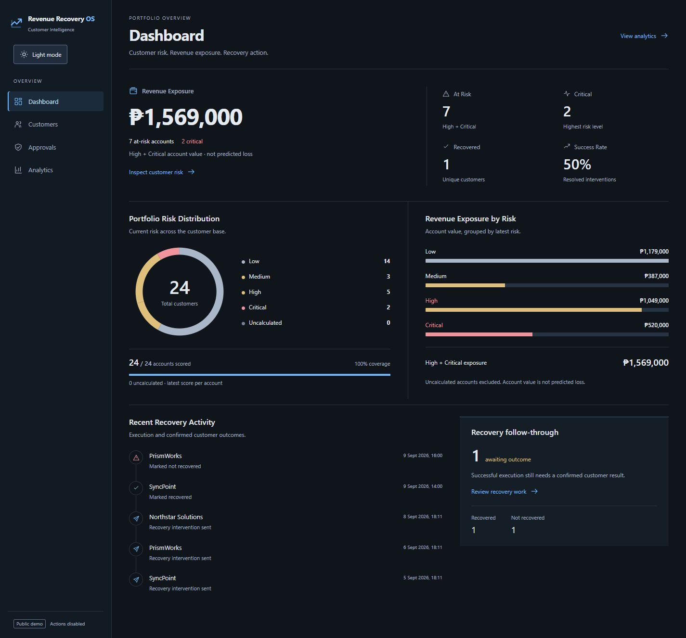
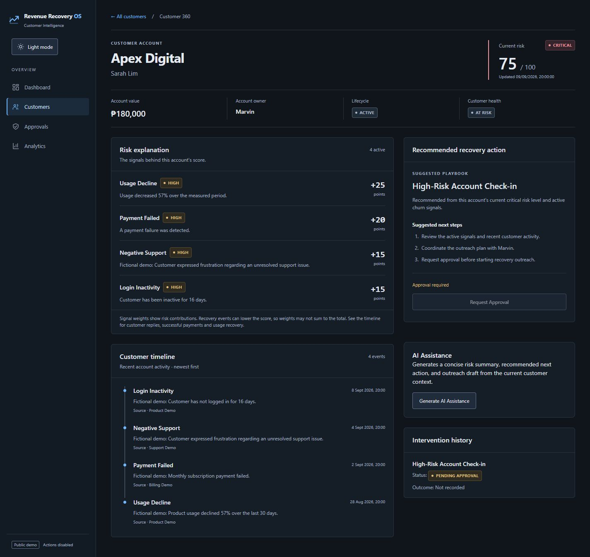
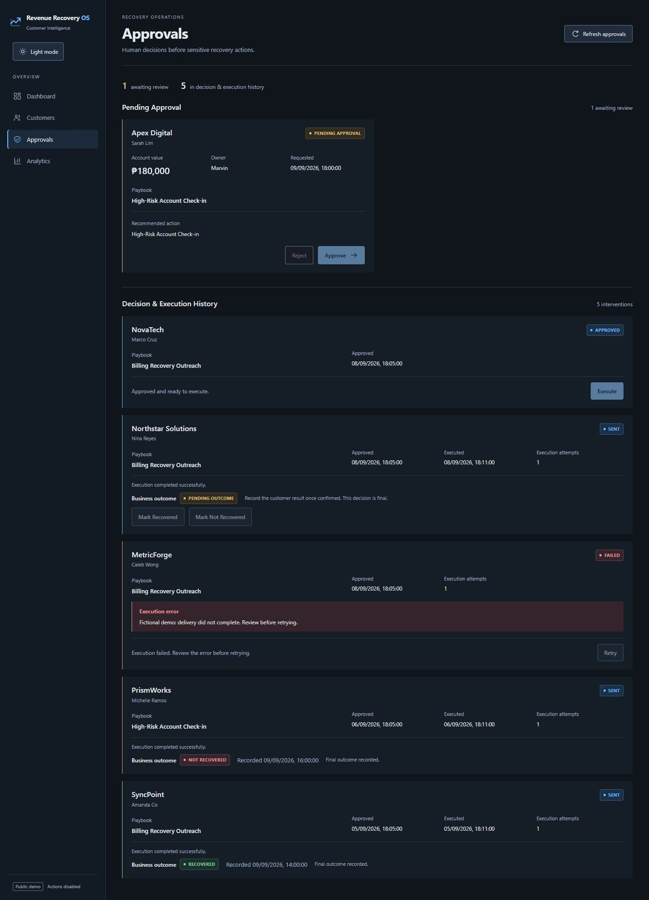
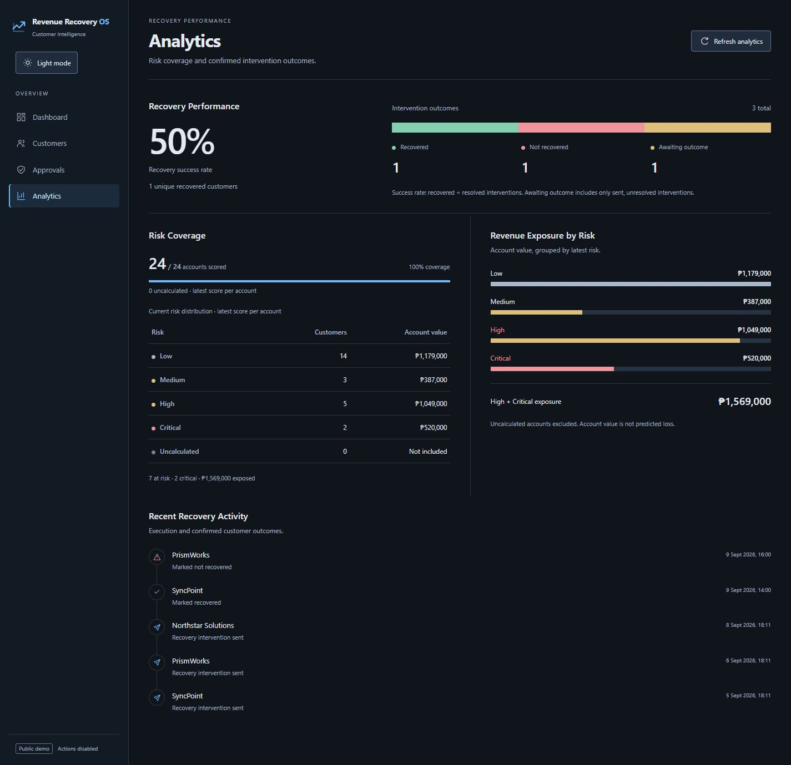
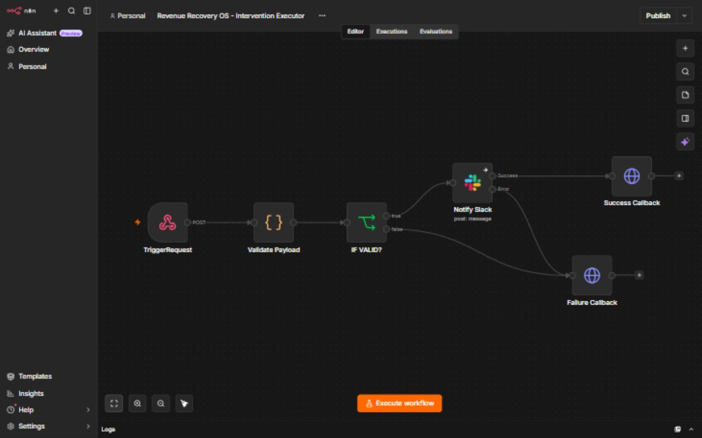

# Revenue Recovery OS

### V1 — Customer Churn & Recovery Intelligence

An explainable customer churn-risk and recovery operations system that turns customer signals into prioritized, human-approved actions with tracked business outcomes.

[Live Demo](https://revenue-recovery-os-et.vercel.app) · [Source Code](https://github.com/emjayyy02/project-06-revenue-recovery-os) · [Architecture](#architecture) · [Key Features](#key-features)

## Overview

Revenue Recovery OS helps Customer Success and RevOps teams identify accounts at risk, understand the evidence, see associated revenue exposure, review recovery recommendations, approve interventions, track execution, and record confirmed outcomes. React provides the workspace; a Cloudflare Worker owns the API and lifecycle; Supabase stores business state; n8n handles external execution.

The public deployment uses fictional, sanitized demo data and runs in read-only demo mode. Explore Dashboard, Customers, Customer 360, search and filters, Approvals history, Analytics, themes, and deterministic assistance. Approval changes, execution, retry, outcome recording, and other business mutations are intentionally disabled.

## Business Problem

Usage, billing, support, and feedback often live in separate systems. A notification workflow can flag an issue without tracking its risk, approval, execution history, or eventual customer result. Revenue Recovery OS connects those steps in one operational record, giving account owners a traceable path from evidence to action and outcome.

## System Flow

```text
Customer events → deterministic risk engine → risk signals + score
    → Customer 360 + revenue exposure → recovery recommendation
    → human approval → n8n execution → success/failure callback
    → confirmed recovery outcome → analytics
```

Events are accepted through the API. Risk recalculation is an explicit operation that derives signals and stores a new score; event ingestion does not automatically run the entire recovery flow.

## Key Features

| Area | Implemented capabilities |
| --- | --- |
| Customer intelligence | Customer 360, activity timeline, signal explanations, health and lifecycle status, account value, owner, combined search/filtering, intervention history |
| Explainable risk | Deterministic rules, visible signal weights and severity, 0–100 score, four risk levels, stored score history and latest-score views |
| Recovery operations | Three recovery playbooks, approval/rejection, execution state, attempt tracking, failure details, manual retry, final outcome recording |
| AI assistance | Risk summary, recommended next action, outreach draft, validated structured provider output, deterministic fallback |
| Analytics | At-risk and critical counts, revenue exposure, risk and outcome distributions, recovery success rate, recent recovery activity |

Risk level and customer health are separate fields. Recording recovery does not automatically change health or recalculate risk. Customer 360 maps medium, high, and critical risk to the three existing playbooks; it does not use AI to select that playbook.

## Architecture

Public deployment:

```text
Public visitor
    → Vercel: React + TypeScript frontend
    → Cloudflare Worker API
    → separate Demo Supabase / PostgreSQL
```

Execution path, available in configured development mode:

```text
Cloudflare Worker → n8n → Slack
    → execution callback → Worker → application/database state
```

| Layer | Responsibility |
| --- | --- |
| React frontend | Presentation and interaction |
| Cloudflare Worker | API, validation, risk calculation, analytics, lifecycle, security |
| Supabase/PostgreSQL | Authoritative business state |
| n8n | External orchestration and execution callbacks |
| AI | Assistance only |
| Human | Sensitive approvals and confirmed outcomes |

n8n is not the system of record. Delivery results return to the Worker, and the application retains the intervention and outcome. See [architecture details](docs/ARCHITECTURE.md).

## Explainable Risk Engine

The [risk engine](backend/src/services/risk-engine.ts) applies these rules to customer events:

| Event / condition | Score contribution |
| --- | ---: |
| Usage decline from 25% through 50% | +15 per qualifying event |
| Usage decline above 50% | +25 per qualifying event |
| Inactivity above 7 through 14 days | +8 per qualifying event |
| Inactivity above 14 days | +15 per qualifying event |
| Exactly one failed payment | +20 |
| Two or more failed payments | +30 total |
| Negative support | +15 per event |
| Negative feedback | +10 per event |
| Customer reply | −10 once |
| Successful payment | −15 once |
| Usage recovered | −20 once |

Positive weights are summed, recovery reductions are subtracted, and the result is clamped to **0–100**. Each recovery reduction applies once when its event type is present, regardless of count. Recovery reductions do not remove positive signal explanations.

| Low | Medium | High | Critical |
| --- | --- | --- | --- |
| 0–24 | 25–49 | 50–74 | 75–100 |

This is deterministic, explainable scoring—not machine-learning prediction. The engine evaluates the supplied event history without time decay. Recalculation reads stored events, replaces current signal rows, and appends a score record.

## Recovery Lifecycle

```text
pending_approval
├─ approve → approved
│  └─ execute → executing
│     ├─ success → sent
│     │  └─ outcome → recovered / not_recovered
│     └─ failure → failed
│        └─ retry → executing
└─ reject → rejected
```

Requests start pending approval. Approval or rejection requires a pending record; execution accepts approved or failed records. Starting execution increments the attempt count and records its time. A webhook-start failure or failure callback records technical failure; a successful callback records delivery.

**Successful technical execution does not mean the customer recovered.** Only a sent, unresolved intervention can receive a confirmed business outcome. That final decision and its timestamp are written together with database conditions that prevent concurrent overwrites.

## AI + Human Boundary

AI may produce a risk summary, recommended next action, and draft message from account context, risk signals, and recent events. It cannot calculate authoritative risk, approve interventions, execute sensitive actions, or record recovery outcomes. Assistance is displayed for review; the UI does not automatically submit its draft as an intervention.

Development can use OpenRouter's chat-completions provider. Returned JSON is validated with Zod. Missing credentials, provider errors, malformed JSON, or invalid output trigger deterministic fallback. The public demo always uses fallback, even if a provider key were present.

## Automation

The [sanitized n8n workflow export](n8n/revenue-recovery-intervention-executor.json) demonstrates:

```text
Webhook Trigger → Validate Payload → IF VALID?
    ├─ valid → Slack notification → Success Callback
    └─ invalid → Failure Callback
```

The Worker sends the intervention ID, customer, playbook, recommendation, optional draft, and attempt number. The workflow validates required fields and returns execution results to the application. Real external execution was demonstrated during the project; current regression tests use mocked outbound HTTP.

The export is inactive and uses placeholders with no credential bindings. Configure it privately before use. Public visitors cannot trigger n8n or Slack. The failure branch covers payload validation; the export does not implement a catch-all Slack-error handler, automatic retries, or exactly-once delivery.

## Reliability & Security

### Reliability

- Zod request and AI-output validation; deterministic scoring and database-backed state.
- A partial unique index prevents duplicate pending interventions for the same customer/playbook; conditional updates protect final outcomes.
- Execution attempts, timestamps, errors, failure states, manual retry, and success/failure callbacks support operational review.
- Customer-event and score history, intervention records, and outcome timestamps provide traceability; this is not an immutable audit log.
- Loading, error, empty, refresh, and disabled-action states support recovery from failed requests. Public 5xx responses omit internal error details.

### V1 public-demo security model

The Worker enforces `APP_MODE=demo`: business mutations return **403 / `DEMO_READ_ONLY`** before privileged database or external work. Missing or invalid modes also deny writes. Frontend controls mirror that boundary; the server remains authoritative.

Production uses exact-origin CORS and a separate Demo Supabase project. The [database hardening migration](supabase/migrations/20260910090000_harden_application_table_access.sql) enables RLS on all six application tables, revokes direct anon/authenticated access, and retains the service-role operations required by the backend. The browser receives no Supabase secret. Health checks are independent of database initialization.

The production configuration requires only the Supabase secret; no production OpenRouter key or n8n execution URL is configured in the repository. Demo mode independently prevents provider calls and external execution. See [database security and verification boundaries](docs/DEMO_DATABASE_SECURITY.md).

## Demo Dataset & Metrics

The [fixed demo seed](supabase/demo_seed.sql) contains **24 fictional customers, 75 events, 43 risk signals, 24 risk scores, 3 recovery playbooks, and 6 interventions**, at a snapshot time of September 9, 2026, 12:00 UTC.

| Snapshot measure | Value |
| --- | ---: |
| Low / Medium / High / Critical | 14 / 3 / 5 / 2 |
| At-risk customers / Critical customers | 7 / 2 |
| Revenue exposure | ₱1,569,000 |
| Unique recovered customers | 1 |
| Recovery success rate | 50% |

These are **fictional portfolio demo figures, not real business outcomes**.

The [analytics service](backend/src/services/analytics.ts) uses the latest score per customer. At risk means high or critical; exposure sums those accounts' values and is not predicted loss or measured recovered revenue. Success rate is recovered interventions divided by resolved interventions, excluding sent records awaiting an outcome. Recovered customers are deduplicated. Recent activity includes dated sends and outcome decisions, up to eight entries. Empty rates return zero; currency is summed in integer cents.

## Tech Stack

| Area | Technology |
| --- | --- |
| Frontend | React, TypeScript, Vite, React Router |
| API | Cloudflare Workers |
| Database | Supabase, PostgreSQL |
| Validation | Zod in backend request and AI-output handling |
| Automation | n8n, webhooks, HTTP APIs |
| External execution | Slack |
| AI assistance | Optional OpenRouter provider; deterministic fallback |
| Testing / linting | Vitest, Cloudflare Vitest plugin, Oxlint |
| Deployment | Vercel, Cloudflare, Wrangler |
| Version control | Git, GitHub |

## Screenshots

Captured from the public demo on September 11, 2026, in dark mode at a 1440px desktop viewport. All data is fictional; business actions remain disabled.

### Revenue Overview



₱1,569,000 exposed across seven at-risk accounts, with 24/24 accounts scored.

### Explainable Customer Risk



Apex Digital's 75/100 score is explained by four visible signals. [View the full Customers workspace](docs/assets/customers.png).

### Human-Approved Recovery Operations



Execution states remain separate from confirmed recovery outcomes.

### Recovery Analytics



Recovery success uses resolved interventions, not successful delivery alone.

### External Execution Workflow



Current local canvas, captured without credential or endpoint details. Its Slack Error → Failure Callback connection is not present in the [sanitized public export](n8n/revenue-recovery-intervention-executor.json); the screenshot does not establish delivery guarantees.

## Local Development

Use a recent Node.js version supported by the installed Vite/Wrangler packages and a separate development Supabase database.

```sh
git clone https://github.com/emjayyy02/project-06-revenue-recovery-os.git
cd project-06-revenue-recovery-os
npm --prefix frontend install
npm --prefix backend install
```

Copy [frontend/.env.example](frontend/.env.example) to `frontend/.env.local` and [backend/.dev.vars.example](backend/.dev.vars.example) to `backend/.dev.vars`. Configure your own database connection server-side. Set `APP_MODE=development` and `VITE_APP_MODE=development` to enable local business actions.

Set `VITE_API_BASE_URL` to your local Worker address and `ALLOWED_ORIGINS` to the exact frontend origin. Despite the older reserved-setting comment in the backend example, `ALLOWED_ORIGINS` is consumed and required for browser CORS. Restart servers after environment changes.

Apply the [SQL migrations](supabase/migrations) to your development database in order using your database tooling. The [development seed](supabase/seed.sql) truncates application tables: use it only in a disposable development database. The public demo seed requires six empty tables and refuses a populated database; do not use the hosted demo as a development target.

Run each server in a separate terminal:

```sh
npm --prefix backend run dev
npm --prefix frontend run dev
```

On Windows PowerShell, use `npm.cmd` and `npx.cmd` if script execution policy blocks their PowerShell shims. Optional AI and automation configuration is only needed to exercise those development integrations.

## Environment Variables

| Scope | Variable | Purpose |
| --- | --- | --- |
| Frontend | `VITE_API_BASE_URL` | Worker API base URL |
| Frontend | `VITE_APP_MODE` | Explicit development mode enables action controls |
| Backend | `APP_MODE` | Explicit development mode permits business writes |
| Backend | `SUPABASE_URL` | Environment-specific database API URL |
| Backend | `SUPABASE_SECRET_KEY` | Server-only database credential |
| Backend | `ALLOWED_ORIGINS` | Comma-separated exact frontend origins |
| Backend | `OPENROUTER_API_KEY` | Optional development assistance provider |
| Backend | `N8N_INTERVENTION_WEBHOOK_URL` | Optional development execution endpoint |

Never commit actual secret values or place server credentials in frontend variables.

## Testing

The verified backend suite contains **100 tests across 7 files**, covering risk rules, intervention lifecycle, outcomes, analytics, demo security, CORS, and error handling. Tests use mocked external HTTP; they do not certify a fresh Slack delivery or hosted database permission check.

```sh
npm --prefix frontend run build
npm --prefix frontend run lint
cd backend
npx tsc --noEmit
npm run test -- --run
cd ..
node supabase/verification/demo-data.cjs
git diff --check
```

The offline demo verifier checks seed structure, relationships, lifecycle ordering, actual risk/analytics outputs, and security-migration statements without connecting to a database.

## Public Demo Limitations

V1 uses fictional data, read-only business actions, deterministic assistance, and no live n8n/Slack execution. Authentication, RBAC, commercial multi-tenancy, automatic outcome attribution, and outcome correction are outside this version. The development write API is intended for a trusted local environment and should not be exposed as an authenticated production service.

## Key Engineering Decisions

- Use deterministic scoring so operators can trace risk to individual signals.
- Keep business state in the application/database while n8n performs external work.
- Require human approval before recovery execution.
- Separate delivery status from confirmed customer recovery.
- Enforce pending-request uniqueness and final-outcome conditions at the database boundary.
- Validate AI output and retain deterministic fallback so assistance is optional.
- Separate development data from the stable public Demo Supabase snapshot.
- Enforce read-only behavior in the Worker, backed by database access restrictions.
